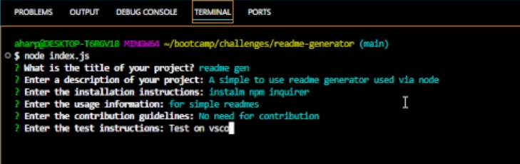

# README GENERATOR

## Description
The ReadMe Generator is an application that can be ran in the terminal. It asks a series of questions and generates a ReadMe with the information provided.

## Table of Contents
- [Installation](#installation)
- [Usage](#usage)
- [License](#license)
- [URLs](#URLs)
- [ScreenShots](#Screenshots)
- [Questions](#questions)

## Installation
Prior to use, users will need to initialize npm and install inquirer.

## Usage
In the terminal, run the following commands:
- `npm init -y`
- `npm i inquirer`
- `node index.js`\
The terminal will proceed to run the program, taking the answers given and returning the README.md file

## URLs
[Live Repo](https://github.com/aharper2568/readme-generator)
[Video Tutorial](https://drive.google.com/file/d/1gykFVmxgJIBcrHl_Mv7tJEtOehtVlXWI/view?usp=sharing)

## Screenshots 

## Questions
If you have any questions, you can reach me at:
- GitHub: [aharper2568](https://github.com/aharper2568)
- Email: anthonyharper2568@gmail.com

## Author

Developed in VSCode by **Anthony Harper** 
